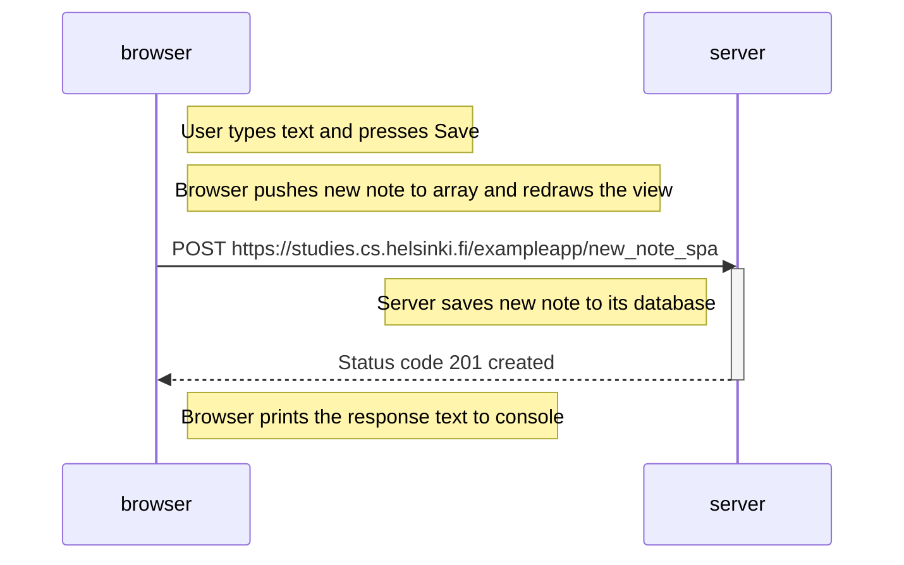

```mermaid
    sequenceDiagram
        participant browser
        participant server
        
        Note right of browser: User types text and presses Save

        Note right of browser: Browser pushes new note to array and redraws the view

        browser->>server: POST https://studies.cs.helsinki.fi/exampleapp/new_note_spa
        activate server

        Note left of server: Server saves new note to its database

        server-->>browser: Status code 201 created
        deactivate server

        Note right of browser: Browser prints the response text to console

```